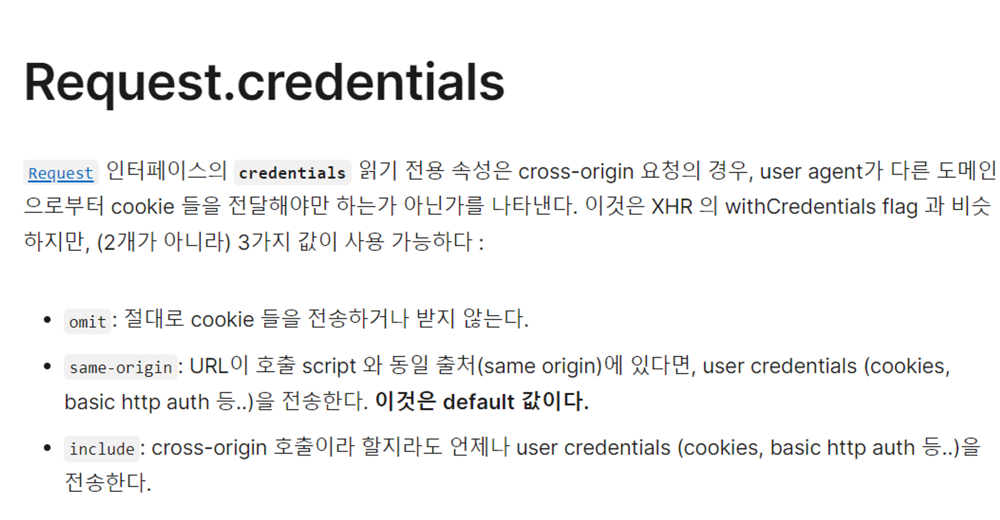
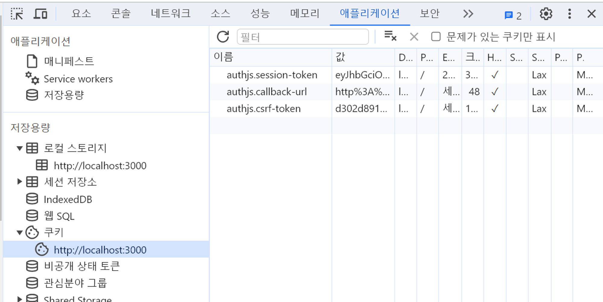

## MSW (Mock Service Worker)
JavaScript를 위한 API 모킹 서비스 라이브러리 </br>
백엔드가 아직 준비되지 않을 때, 모킹 라이브러리인 msw로 미리 화면을 구성해볼 수 있다. </br>
만약, 백엔드가 준비되더라도 에러를 발생시켜야 하는 환경, 로그인이 되었을 때의 화면 등을 테스트 해보고 싶을 때 유용하게 사용할 수 있다.

</br>

#### ✔️ MSW 설치
```
npm install msw --save-dev
```

</br>

#### ✔️ 로컬의 public 폴더 아래에 세팅(초기화)
/public/mockServiceWorker.js 파일이 생성되며, --save 옵션을 사용하면 package.json에 등록되고 </br>
msw를 업데이트 할 때마다 자동으로 해당 항목을 업데이트 한다.

```
npx msw init public/ --save
```

</br>

#### ✔️ mockServiceWorker.js

실제 서버로 보내지는 요청이 있다면 mockServiceWorker가 가로채서 mockServiceWorker에서 응답을 준다.

-> 옛날에 없었을 때는, 개발 환경용 주소와 실제 환경용 주소를 따로 넣어 주었어야함!

🔵 백엔드 개발자에게 부탁하지않고도 에러상황들을 목 서비스 워커를 통해 만들어낼 수 있다는 장점이 있음

📂 mocks </br>
L 📄 browser.ts  </br>
L 📄 handlers.ts  </br>
L 📄 http.ts  </br>

#### http-middleware: msw로 mock server를 만들기 위해 필요한 라이브러리
```
npm i -D @mswjs/http-middleware express cors @types/express @types/cors
```

[msw 공식문서 Migration](https://mswjs.io/docs/migrations/1.x-to-2.x)

[Set-Cookie : MDN](https://developer.mozilla.org/en-US/docs/Web/HTTP/Headers/Set-Cookie)

## HTTP VS HTTPS

HTTP는 인터넷에서 정보를 주고받는데 사용되는 프로토콜(규약) 중 하나

쉬운말로, 이것은 마치 편지를 보낼 때 사용하는 우편물과 같다 

하지만 HTTP는 안전한 방법으로 정보를 전송하지 않음!

-----------

반면에 HTTPS는 HTTP의 안전한 버전

여기서 'S'는 'Secure(안전한)'를 뜻함. 

HTTPS를 사용하면 정보가 인터넷을 통해 전송될 때 암호화되어 있음

이는 마치 특별한 암호로 편지를 봉인하여 안전하게 보내는 것과 같다

간단히 말하면, HTTP는 편지를 보내는 것이지만, HTTPS는 안전하게 봉인된 편지를 보내는 것과 같다. 

그래서 HTTPS를 사용하면 개인 정보나 중요한 정보를 안전하게 보낼 수 있다!!


## MSW 서버 실행
package.json에 서버 실행 명령 스크립트를 등록한다.
watch 옵션으로 인해 서버 코드가 수정되면 서버가 자동으로 재시작되기 때문에 유용하게 사용할 수 있다.

💡
서버 코드는 수정되면 재시작 되어야 수정이 반영된다

```json
"scripts": {
  "dev": "next dev",
  "build": "next build",
  "start": "next start",
  "lint": "next lint",
  //이 부분 추가 
  "mock": "npx tsx watch ./src/mocks/http.ts"
},
```

터미널 하나 더 띄워서 명령어를 입력해용

`npm run mock`

### .env

NEXT_PUBLIC_ 환경 변수는 **브라우저**에서도 접근이 가능하기 때문에 `src` 폴더에서 해당 환경 변수에 접근할 수 있다.
만약, NEXT_PUBLIC 이 없는 API_MOCKING 이라는 이름의 환경 변수라면 서버에서만 접근 가능하다.


## 회원가입 기능

### ✔️ 서버 컴포넌트 생각하기

Nextjs의 `Server Actions` 를 서버 컴포넌트에서 사용해보자.

`use client` 와 기존의 hook, 이벤트 핸들러 등을 지워줭야함

state 없이 어떻게 구현할 수 있을까?

### ✔️ 이벤트 핸들러 처리

이벤트 핸들러는 클라이언트 컴포넌트에서 사용 가능하다. 서버 컴포넌트로 변환하고자 하는 클라이언트 컴포넌트에 이벤트 핸들러가 있다면, 해당 요소를 클라이언트 컴포넌트로 따로 분리해주면 된다.

**onClickClose**

예를 들어 현재 SignupModal의 `onClickClose` 이벤트 핸들러가 붙은 모달 닫기 버튼을 컴포넌트로 따로 분리할 수 있다.


### input과 submit button 처리

**state가 없다면 기존에 html, js로 처리했던 form을 생각해주면 된다.**

state를 사용하여 value 값과 이벤트 핸들러를 처리했던 **input**은 `value` 와 `handler` 부분을 지워주고, 

`name` 속성과 `required` 속성을 붙여준다.

button과 form의 경우 button의 타입을 submit으로, form의 action 속성을 사용한다. 

이 때 form의 action 속성에 들어가는 값이 Server Actions이다.


## ✔️ redirect 처리
회원가입 후, 로그인까지 시켜서 바로 메인화면으로 이동시켜주기 위해 redirect()를 사용한다.

#### redirect()는 try-catch문 안에서 사용할 수 없으므로 주의!!!

오류가 발생하더라도 홈 화면으로 이동되어 사용자에게 혼란을 줄 수 있다는 것이다.</br>
따라서 **별도의 변수**를 두어 처리하는 것이 좋다.

```tsx
const submit = async (formData: FormData) => {
  "use server";

  let shouldRedirect = false;

  try {
    const response = await fetch(
      `${process.env.NEXT_PUBLIC_BASE_URL}/api/users`,
      {
        method: "post",
        body: formData,
        credentials: "include", // 이 속성이 있어야 쿠키 전달 가능
      }
    );
    //성공시 true
    shouldRedirect = true;
  } catch (err) {
    console.error(err);
    shouldRedirect = false;
  }

  if (shouldRedirect) {
    redirect("/home");
  }
};
```

## ✔️ formData 검증

입력된 데이터거나 중복 사용자가 있을 때 message를 바로 return 해주어 서버에 불필요한 요청을 하지 않게끔 처리한다.

#### return 해주는 message는 클라이언트 컴포넌트에서 처리해서 보여주어야 사용자에게 보인다.

```tsx
const submit = async (formData: FormData) => {
    "use server";

    // formData 검증 - error message띄워줄 부분
    if (!formData.get("id")) {
      return { message: "no_id" };
    }
    if (!formData.get("name")) {
      return { message: "no_name" };
    }
    if (!formData.get("password")) {
      return { message: "no_password" };
    }
    if (!formData.get("image")) {
      return { message: "no_image" };
    }

    let shouldRedirect = false;

    // 위에 값들이 없으면 아예 아랫부분이 실행이 안되게끔
    try {
      const response = await fetch(
        `${process.env.NEXT_PUBLIC_BASE_URL}/api/users`,
        {
          method: "post",
          body: formData,
          credentials: "include", // 이 속성이 있어야 쿠키 전달 가능
        }
      );

		// 중복 사용자 체크 (BE developer와 약속하면 됨)
      if (response.status === 403) {
        // 이미 회원가입한 아이디 있을 경우
        return { message: "user_exists" };
      }

      shouldRedirect = true;
    } catch (err) {
      console.error(err);
      shouldRedirect = false;
    }

    if (shouldRedirect) {
      redirect("/home");
    }
  };
```

### input에 required 속성이 있음에도 데이터의 검증이 따로 필요할까?
클라이언트 측에서의 유효성 검증 외에 서버 측에서도 유효성 검증을 수행하는 것이 중요하다.  </br>
클라이언트 측 검증은 브라우저의 도구를 통해 우회할 수 있기 때문에 서버 측에서도 검증을 해야 보안이 강화된다.


["useFormState()" 리액트 공식문서](https://react.dev/reference/react-dom/hooks/useFormState)


useFormStatus: 마지막 양식 제출의 상태 정보를 제공하는 Hook


["useFormStatus()" 리액트 공식문서](https://react.dev/reference/react-dom/hooks/useFormStatus)


### Server Actions 함수 작성

```tsx
const submit = async (formData: FormData) => {
    "use server";

    const response = await fetch(
      `${process.env.NEXT_PUBLIC_BASE_URL}/api/users`,
      {
        method: "post",
        body: formData,
        credentials: "include", // 이 속성이 있어야 쿠키 전달 가능
      }
    );
    redirect("/home");
  };
```

매개변수의 `formData` 의 경우 `formData.get('id')` 메소드로 `form`안의 데이터들을 가져올 수 있다. </br>
get 메서드의 인자로는 `name` 속성에 작성한 값들을 넘겨주면 된다.


[FormData.get() MDN 공식문서](https://developer.mozilla.org/ko/docs/Web/API/FormData/get)


#### 쿠키는 이미 로그인한 사람이 회원가입을 하고 있는지 알 수 있고, 이외에도 유용한 기능을 구현할 수 있다.

사용자 경험을 향상시키고 웹 애플리케이션의 기능을 확장하는 데 매우 유용한 도구로 활용됨

단, 개인 정보 보호와 관련된 문제에 대해 신중하게 고려하여 사용해야 합니다.

```
[ 사용자 인증 및 세션 관리 ]
쿠키는 사용자의 로그인 상태를 추적하고 세션을 유지하는 데 사용될 수 있습니다.
사용자가 로그인하면 서버에서 쿠키를 설정하여 해당 사용자의 로그인 상태를 기억하고, 
사용자가 로그아웃할 때까지 세션을 유지합니다.

[ 사용자 환경 설정 저장 ]
사용자가 웹 애플리케이션의 환경 설정을 변경하면 쿠키를 사용하여 이러한 설정을 기억할 수 있습니다. 
예를 들어, 사용자가 언어, 테마, 레이아웃 등의 환경 설정을 변경하면 
이를 쿠키에 저장하여 다음 방문 시에도 동일한 설정을 유지할 수 있습니다.

[ 광고 타게팅 및 추천 시스템 ]
쿠키를 사용하여 사용자의 행동 이력을 추적하고, 이를 기반으로 사용자에게 맞춤형 광고를 제공하거나 
제품 추천을 구현할 수 있습니다. 이를 통해 사용자 경험을 개선하고 광고 효율을 높일 수 있습니다.

[ 장바구니 관리 및 이커머스 기능 ]
이커머스 웹사이트에서는 쿠키를 사용하여 사용자의 장바구니 상태를 유지하고, 
사용자가 상품을 추가하거나 제거할 때 이를 즉시 반영할 수 있습니다.

[ 사용자 추적 및 분석 ]
쿠키를 사용하여 사용자의 행동 이력을 추적하고 분석할 수 있습니다. 
이를 통해 사용자가 웹사이트를 어떻게 이용하는지에 대한 통찰력을 얻고, 사용자 경험을 개선할 수 있습니다
```





### ✔️ next-auth 설치
`npm i next-auth@beta @auth/core`


### ✔️ Middleware

nextjs에서 페이지를 렌더링하기 전에 서버 측에서 실행되는 함수

즉, 특정한 요청 전 무언가 수행할 수 있게 해주는 기능!

`Middleware`에서는 `Request` 객체와 `Response` 객체에 접근할 수 있으며

이를 활용해 요청 정보를 받아와 부가적인 처리를 하고 응답 객체에 무언가를 추가하거나 응답을 변경할 수 있다.

특정 조건에 맞는 유저만 url에 접근가능하게끔 할 수 있다.

##### middleware.ts는 src 폴더에 포함되거나, app과 같은 수준의 트리에 존재해야 한다.


[미들웨어 nextjs 공식문서](https://nextjs.org/docs/app/building-your-application/routing/middleware)


#### 앱라우터는 미들웨어를 통해서 페이지 접근권한 관리가 쉬워졌다.

## 간편로그인 next-auth

- 로그인에 따른 쿠키도 관리해줌


[next-auth 공식문서](https://next-auth.js.org/getting-started/example)


### ✔️ API 라우트

브라우저처럼 실제 주소가 된다.

`route.ts` 는 백엔드 서버처럼 프론트 서버의 API 역할을 해서 백엔드 서버 없이도 서버 역할을 할 수 있다.

### ✔️ catch-all 라우트

- `[...segmentName]`

동적 세그먼트에서 `...` 를 추가하면 catch-all 세그먼트를 만들 수 있다.

URL에서 `...slug` 에 오는 부분들을 slug 배열로 반환한다.


[다이나믹 라우팅 nextjs공식문서](https://nextjs.org/docs/pages/building-your-application/routing/dynamic-routes#catch-all-segments)


동적 세그먼트는 useRouter.에서 액세스할 수 있습니다 


## 환경 변수 설정

`.env`

```
AUTH_URL=http://localhost:9090 # next.js가 실행될 URL
AUTH_SECRET=mysecret # 쿠키를 암호화하는 비밀번호 유출 시 나인척 로그인가능 조심해서간직
```

## useSession()
useSession()을 사용하기 위해서는 SessionProvider로 랩핑이 되어 있어야 한다.


### ✔️ SessionProvider 정의하기

```tsx
// src\app\_component\AuthSession.tsx
"use client";
import { SessionProvider } from "next-auth/react";

type Props = {
  children: React.ReactNode;
};

export default function AuthSession({ children }: Props) {
  return <SessionProvider>{children}</SessionProvider>;
}
```

Provider들은 대게 클라이언트 컴포넌트로 사용된다.


서버 컴포넌트의 경우 next-auth를 통해 만들었던 `auth()` 함수를 통해 로그인 정보를 가져와준다.

## csrf-token



next-auth를 설치하게 되면 쿠키에 `authjs-` 쿠키들이 생성되는데, </br>
로그인을 할 경우 `authjs.session-token` 값이 주어진다.

이 토큰이 유출되면 해커가 자유롭게 내 정보로 로그인을 할 수 있게 된다.

이 csrf 공격으로 인해 유출될 수 있는데, next-auth에서는 `authjs.csrf-token`를 통해 이 공격을 방어할 수 있다.


## middleware

미들웨어의 본래 기능은 요청과 응답 사이의 중간 단계로 동작하여 요청을 처리하고 응답을 생성하는 역할

미들웨어를 사용하여 리다이렉트를 처리하는 경우, 주로 요청을 검사하고 필요한 경우 클라이언트를 다른 페이지로 리디렉션하는 등의 작업을 수행

```jsx
const myMiddleware = (req, res, next) => {
    // 조건에 따라 리다이렉트를 수행
    if (/* 리다이렉트 조건 */) {
        // 클라이언트를 다른 페이지로 리다이렉트
        res.redirect('/other-page');
    } else {
        // 다음 미들웨어로 이동
        next();
    }
};

// 미들웨어를 Express 애플리케이션에 등록
app.use(myMiddleware);
```

